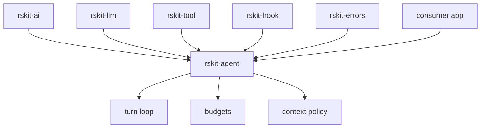

# rskit-agent — turn-based agent loop

`rskit-agent` runs a bounded agent loop over an injected LLM provider, optional tool registry, and hook registry. It owns turn limits, token budgets, wall-clock budgets, tool-call limits, and context compaction.

## Install

```toml
[dependencies]
rskit-agent = "0.1"
rskit-errors = "0.1"
rskit-llm = "0.1"
rskit-tool = "0.1"
```

## Architecture



## Quick start

```rust
use std::sync::Arc;

use rskit_agent::{Agent, AgentConfig};
use rskit_llm::user;
use rskit_llm_providers::ollama::{self, Config};

#[tokio::main]
async fn main() -> Result<(), Box<dyn std::error::Error>> {
    let provider = Arc::new(ollama::new_adapter(&Config {
        base_url: "http://localhost:11434".into(),
        model: "llama3.2".into(),
        api_key: None,
    })?);

    let agent = Agent::new(
        provider,
        AgentConfig {
            system_prompt: "You are concise and operationally precise.".into(),
            model: "llama3.2".into(),
            ..AgentConfig::default()
        },
    );

    let result = agent
        .run(vec![user("Write a two-line release summary.")])
        .await?;

    println!("{}", result.final_message.text());
    Ok(())
}
```

## When to use

Use `rskit-agent` when you want the bounded turn loop, tool execution, hook points, and context-budget logic without rebuilding orchestration yourself.
