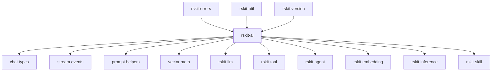

# rskit-ai

Shared AI vocabulary for rskit AI/ML crates: messages, multimodal content, tool-use blocks, usage, models, stream events, prompt helpers, and vector math.

## Architecture

```mermaid
graph TD
    errors[rskit-errors]
    util[rskit-util]
    version[rskit-version]
    ai[rskit-ai]
    chat[chat types]
    stream[stream events]
    prompt[prompt helpers]
    vector[vector math]
    llm[rskit-llm]
    tool[rskit-tool]
    agent[rskit-agent]
    embedding[rskit-embedding]
    inference[rskit-inference]
    skill[rskit-skill]

    errors --> ai
    util --> ai
    version --> ai
    ai --> chat
    ai --> stream
    ai --> prompt
    ai --> vector
    ai --> llm
    ai --> tool
    ai --> agent
    ai --> embedding
    ai --> inference
    ai --> skill
```
