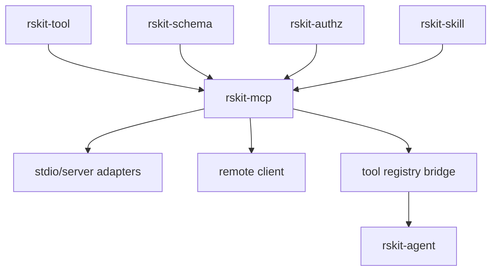

# rskit-mcp — Model Context Protocol bridge

`rskit-mcp` exposes an `rskit-tool` registry through MCP and can discover remote MCP tools for use inside rskit applications. It keeps tool execution policy in `rskit-tool::Envelope` while mapping MCP wire types at the boundary.

## Install

```toml
[dependencies]
rskit-mcp = "0.2.0-alpha.1"
rskit-tool = "0.2.0-alpha.1"
```

## Architecture



## Quick start

```rust
use std::sync::Arc;

use rskit_mcp::{ServerConfig, create_server};
use rskit_tool::Registry;

fn main() {
    let tools = Arc::new(Registry::new());

    let _handler = create_server(
        "example-mcp",
        "0.1.0-alpha.1",
        tools,
        ServerConfig {
            prefix: "local.".into(),
            ..ServerConfig::default()
        },
    );
}
```

## When to use

Use `rskit-mcp` when you need to expose a local tool registry through MCP or consume remote MCP tools without letting protocol concerns leak into the core tool layer.
