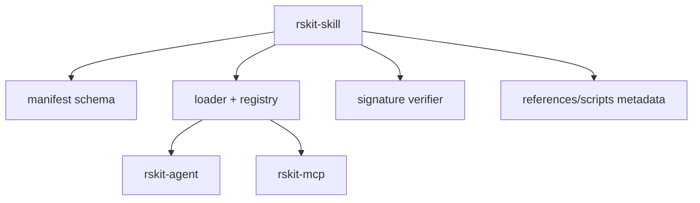

> **Note:** This `skill` primitive borrows the `SKILL.md` filename and progressive-disclosure model from Anthropic Agent Skills. It is a distinct primitive and makes no interop claim with Claude Code or the Anthropic runtime.

# rskit-skill

SDK-free skill manifests, progressive-disclosure loaders, registries, providers, and verifier contracts for rskit agentic applications.

The manifest file is `kit.skill.yaml`. `scripts/` and `references/` are inert assets: the loader records path and SHA-256 and never executes them.

## Architecture

