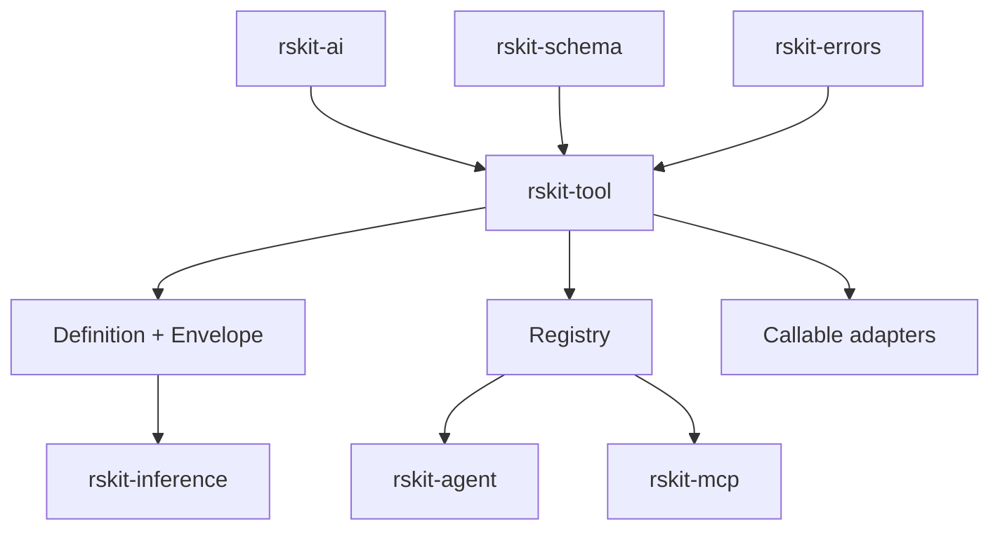

# rskit-tool

Tool definitions, callable adapters, JSON Schema I/O, structured results, registries, and executable permission envelopes.

## Middleware ownership

`rskit-tool` intentionally does not expose local `with_logging`, `with_timeout`, `with_recover`, retry, metrics, validation, or result-limit middleware. Compose those concerns with their canonical owners: `tracing`/`rskit-observability`, `tower`/`rskit-resilience`, `rskit-schema`/`rskit-validation`, and `rskit-security`.

## Envelope

Every `Definition` includes an `Envelope`. Defaults deny network, filesystem, and subprocess access; `safety` defaults to `read-only`; `data_classification` defaults to `public`.

## Architecture

