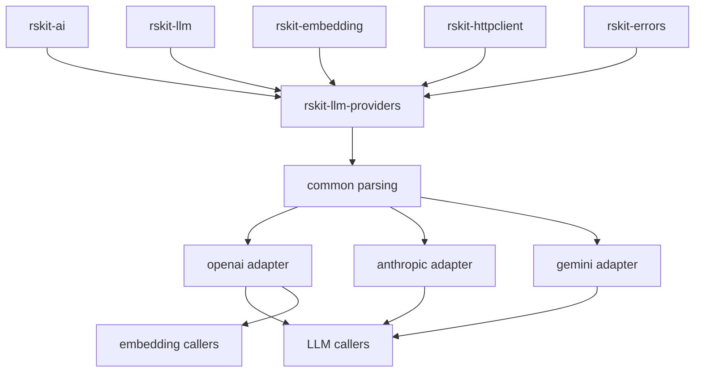

# rskit-llm-providers

Provider adapters for OpenAI, Anthropic, Gemini, and Ollama. This crate translates provider wire formats into `rskit-llm` and `rskit-ai` canonical types and shares transport/auth plumbing with embedding adapters.

## Architecture



## Providers

| Provider | Role | Status |
| --- | --- | --- |
| OpenAI | Chat + embeddings via OpenAI-compatible API | ✅ Implemented |
| Anthropic | Claude messages adapter | ✅ Implemented |
| Gemini | Gemini chat adapter | ✅ Implemented |
| Ollama | First-class local/provider-hosted adapter reusing the OpenAI wire dialect | ✅ Implemented |

## Install

```toml
[dependencies]
rskit-llm-providers = "0.1"
rskit-llm = "0.1"
tokio = { version = "1", features = ["macros", "rt-multi-thread"] }
```

## Quick start

```rust
use rskit_llm::{CompletionRequest, Provider, user};
use rskit_llm_providers::ollama::{self, Config};

#[tokio::main]
async fn main() -> Result<(), Box<dyn std::error::Error>> {
    let provider = ollama::new_adapter(&Config {
        base_url: "http://localhost:11434".into(),
        model: "llama3.2".into(),
        api_key: None,
    })?;

    let response = provider
        .complete(CompletionRequest {
            model: String::new(),
            messages: vec![user("Return one sentence about local inference.")],
            max_tokens: Some(96),
            temperature: Some(0.2),
            stream: false,
            tools: None,
            tool_choice: None,
        })
        .await?;

    println!("{}", response.text());
    Ok(())
}
```

## When to use

Import only the adapters you want to compose. Registration and construction are explicit so provider choice stays config-driven and side-effect free.
