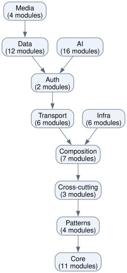
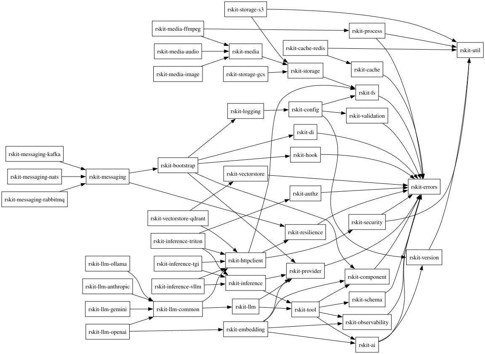

# rskit Design Decisions

Why rskit looks the way it does — and how it differs from its sibling [gokit](https://github.com/kbukum/gokit) (Go).

## Core decisions

| Decision | Rationale |
|---|---|
| `ErrorCode` as enum, not strings | Exhaustive pattern matching, derives `Hash`/`Copy`, no typos |
| `tower::Layer` for middleware | Industry standard, free tonic interop, composable |
| `futures::Stream` extension trait | Native async, tokio time interop, works with gRPC streaming |
| `governor` for rate limiting | Production-grade, injectable clock for deterministic tests |
| `parking_lot::Mutex` for circuit breaker | Non-poisoning, never held across `.await`, ~50% faster |
| `CancellationToken` for shutdown | Idiomatic Tokio cooperative cancellation |
| Typestate `App<S, C>` | Compile-time lifecycle ordering — can't call `run` before `build` |
| `rskit-di` Arc-based DI | Opt-in, lightweight; Rust's type system reduces the need |
| `JoinSet` + `Semaphore` for worker pool | Idiomatic Tokio, panic detection via `JoinError`, zero boilerplate |
| mpsc → broadcast relay in pool | Allows `T: Clone` without `T: Sync`, scales to N subscribers |

## How rskit differs from gokit

rskit mirrors gokit's package structure and lifecycle philosophy. Key differences come from idiomatic Rust:

| gokit (Go) | rskit (Rust) | Why |
|---|---|---|
| `ErrorCode` as string constants | `ErrorCode` enum | Exhaustive match, compile-time safety |
| Custom `Middleware[I,O]` chain | `tower::Layer` | Industry standard |
| Custom pull-based `Iterator[T]` | `futures::Stream` extension | Native async |
| Custom token bucket | `governor` | Production-grade, testable |
| `sync.Mutex` in CB | `parking_lot::Mutex` | Non-poisoning |
| `context.Context` cancellation | `CancellationToken` | Rust-idiomatic |
| Goroutine-per-worker pool | `JoinSet` pool | Idiomatic Tokio |
| Implicit DI via `bootstrap` | `rskit-di` container, opt-in | Lightweight `Arc`-based |

See [`adr/`](adr/) for full Architecture Decision Records, and [`adr/0001-layered-crate-architecture.md`](adr/0001-layered-crate-architecture.md) for the layering rationale.

## Dependency graphs

rskit is a split workspace family (`core/` and `contrib/`) with no unifying root manifest, so these graphs are generated at two complementary levels rather than as one cross-workspace dump.

### Domain layers

The big-picture view: the ten domains from [`domains.toml`](../domains.toml) and the dependency direction between them, following the layered architecture in [`adr/0001-layered-crate-architecture.md`](adr/0001-layered-crate-architecture.md). Edges are transitively reduced, so each arrow is an essential layer boundary — a domain only points at the next layer it builds on, never at every ancestor.



### Contrib adapters

The crate-level detail for the adapter layer: each contrib crate (cache, storage, messaging, vectorstore, inference, llm, media) and the specific core crates it builds on. Transitive third-party dependencies are excluded for readability.



### Regenerating the graphs

```bash
make depgraphs
```

This regenerates `graph-domains.svg` and `graph-contrib.svg` in `docs/depgraphs/`. `make setup` installs `cargo-depgraph`, but Graphviz `dot` is only installed when system tools are enabled (`scripts/setup.sh --system`, or `INSTALL_SYSTEM_TOOLS=1`); otherwise install Graphviz manually. Regenerate whenever domains or crate dependencies change.
