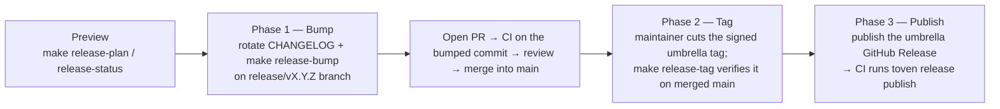

# Releasing

The mechanical steps to cut a release of `rskit`. For *what* counts as a breaking change vs a feature vs a fix, see [`policy/SEMVER.md`](policy/SEMVER.md) and [`policy/DEPRECATION.md`](policy/DEPRECATION.md).

## Prerequisites

- You are listed in `MAINTAINERS.md` and have push access to `kbukum/rskit`.
- Your local clone is on `main` with no uncommitted changes.
- Run `make setup` first; for local release pre-flight checks, also run `scripts/setup.sh --release`
  and ensure `git`, `gh`, `cargo`, `cargo-nextest`, `cargo-deny`, `cargo-audit`, `cargo-llvm-cov`,
  `cargo-cyclonedx`, and `cosign` are on your `$PATH`.
- [Toven](https://github.com/kbukum/toven) drives the release through three separable phases —
  **bump**, **tag**, and **publish**. It owns the version bump, the release commit, signed tagging,
  the crates.io publication, SBOM generation, and the readiness gate. Install the pinned binary
  (`curl … scripts/install.sh | sh` from the toven repo, or the `kbukum/toven` action in CI) so
  `toven` is on your `$PATH`; the `make release-*` targets delegate to it. cargo
  (deny/audit/cyclonedx/publish) must still be installed because Toven shells out to it.
- A repository Actions secret named `CARGO_REGISTRY_TOKEN` is configured for crates.io publishing.
  The release workflow skips crates.io publishing when this secret is absent.

This repository has split Cargo workspaces:

- `core/Cargo.toml` for foundation crates and the `rskit-suite` facade package, whose Rust crate name remains `rskit`.
- `contrib/Cargo.toml` for adapter crates.
- `examples/Cargo.toml` for demos; examples are validated but not published.

There is intentionally no root `Cargo.toml`.

## Flow at a glance

`main` is protected and rejects direct pushes, so the version bump commit must land through a reviewed pull request — never a direct push. Toven's `[ecosystems.rust.release]` sets `push_branch = false` and `entrypoint = "maintainer"`, so the maintainer cuts the single signed umbrella `vX.Y.Z` tag by hand on the merged commit and `release tag`/`release publish` only *verify* that tag — Toven never creates, moves, or pushes it. The release therefore runs as three ordered phases, each previewable and applied on its own:



The phases map one-to-one onto Toven verbs: **bump** (`toven release bump`, no tag/push/publish), **tag** (`toven release tag`, verifies the umbrella tag exists at HEAD), **publish** (`toven release publish`, crates.io). Each is independent and idempotent; running a later phase never re-does an earlier one.

## 1. Decide the version

```sh
# What's the latest tag?
git tag --sort=-v:refname | head -1

# What changed since then?
git log --oneline $(git describe --tags --abbrev=0)..HEAD
```

Use the [SEMVER policy](./policy/SEMVER.md) to pick the next version. While in `0.x`, every release with a breaking change in the `[Unreleased]` CHANGELOG section bumps MINOR; otherwise PATCH.

## 2. Update the CHANGELOG

1. Open `CHANGELOG.md`.
2. Replace `## [Unreleased]` with `## [vX.Y.Z] - YYYY-MM-DD`.
3. Add a fresh empty `## [Unreleased]` section above it.
4. If the newly created `[vX.Y.Z]` release section is empty, refuse to release —
   there is nothing to ship.
5. Update the link reference at the bottom of the file (if present).

As a maintainer rule, do not cut the release if `[Unreleased]` is the only populated section, or if `[vX.Y.Z]` for the version you're cutting doesn't exist in the file.

## 3. Preview the release

Toven derives per-crate versions, tags, and publish order from the dependency graph and the Conventional-Commit history since each crate's last tag. Preview it before mutating anything:

```sh
make release-plan     # bumped versions, tags, changelog, and publish order (read-only)
make release-status   # declared vs published vs tagged versions (read-only)
```

Crates are versioned **independently**: each bumps only when it changed, plus the correct dependency cascade. Toven writes the manifest bumps, refreshes the caret floors, re-syncs the README install-snippet version pins, and keeps the split lockfiles in sync during the bump phase — you do not hand-edit versions. The CHANGELOG rotation from step 2 and Toven's manifest bumps are committed together on the release branch in step 5 (phase 1), then reviewed as one PR.

## 4. Pre-flight checks

```sh
make check
make deny
make release-readiness
make release-coverage
make publish-dry-run
make release-sbom
```

`make release-readiness` runs Toven's fail-closed go/no-go preflight (clean tree, changelog present, registry idempotency, and the configured `deny`/`audit` checks). `make publish-dry-run` rehearses the full pipeline — the per-crate would-publish / already-published verdicts and the dependency-ordered publish plan — without mutating anything. If any check fails, fix it before publishing.

### First-release note

On the first release every crate is new, so `cargo publish --dry-run` cannot resolve an unpublished internal same-version sibling from crates.io. Toven's dry-run reports those crates as blocked-by-unpublished-dependency rather than failing, and the real publish (step 5) walks the dependency order so each crate is on crates.io before its dependents are published. The reliable first-release gate is the combination of the full build/test/docs/audit/coverage sweep, Toven's generated publish order, and the dependency-ordered publish itself.

## 5. Cut and publish the release

The release runs as three ordered phases. `main` is protected, so the version bump lands through a reviewed PR (phase 1); tagging and publishing happen only after it merges (phases 2–3). Toven's `push_branch = false` guarantees the tag/publish phases push tags only, never a branch commit.

### Phase 1 — Bump (reviewed PR into `main`)

**You** create the release branch, commit, and open the PR — Toven only computes and *writes* the version bumps into the working tree, it never creates the branch, the commit, or the PR:

```sh
git switch -c release/vX.Y.Z         # you create the branch (clean tree)
make release-bump                    # toven release bump --yes: stages per-crate version bumps + floors + README pins, NO commit
# rotate CHANGELOG.md per step 2, then commit everything yourself:
git add -A
git commit -S -m "chore(release): vX.Y.Z"
git push -u origin release/vX.Y.Z
gh pr create --fill                  # open the PR; CI runs on the bumped commit
```

`make release-bump` runs `toven release bump --yes`, which is **stage-only**: it rewrites the manifest versions and dependency floors, re-syncs the README install-snippet version pins (via the `on_resolved` hook — see below), and stages them in your working tree — no commit, no tag, no push, no publish. The bump is **change-gated**: only crates with a real diff since their baseline bump, plus the correct dependency cascade; untouched crates keep their version. Review and merge the PR into `main` the normal way. The bumped versions are now on `main`, reviewed and CI-green.

The README install-snippet pins (every crate `README.md` under the repo root, `core/`, and `contrib/`) track the crate versions automatically. Toven's native `version_references` sync is line-anchored to simple `crate = "x.y.z"` pins; rskit's snippets also use table-attribute (`crate = { version = "x.y.z", features = [..] }`) and column-aligned pins, so the umbrella's bump `on_resolved` hook runs `scripts/rskit_tool.py sync-readme-versions`, handed Toven's authoritative resolved-version map, to rewrite every pin shape. Those edits are staged with the manifests, so you never hand-edit README versions.

### Phase 2 — Tag (on the merged commit)

With your local `main` fast-forwarded to the merged release commit and a clean tree, the maintainer creates the single signed umbrella tag by hand, then verifies it:

```sh
git switch main && git pull --ff-only
git tag -s vX.Y.Z -m "release rskit-suite X.Y.Z" && git push origin vX.Y.Z
make release-tag         # verifies the maintainer's signed umbrella vX.Y.Z tag is at HEAD
```

Because the manifests already carry the target versions, the bump phase inside `release tag` is a no-op; under `entrypoint = "maintainer"` Toven never creates or moves the tag — it only confirms the maintainer's umbrella `vX.Y.Z` tag exists at HEAD. This satisfies the CI reachability check (`tag reachable from origin/main`).

### Phase 3 — Publish

**CI (recommended).** Publish the umbrella GitHub Release on the existing tag as the trigger:

1. Open <https://github.com/kbukum/rskit/releases/new>.
2. Set **Choose a tag** to the **existing** `vX.Y.Z` tag pushed in phase 2 (do not create a new tag on publish).
3. Set **Target** to `main`.
4. Use **Generate release notes**.
5. For pre-releases such as `v0.1.0-alpha.1`, check **Set as a pre-release**.
6. Publish the release.

Toven's maintainer entrypoint treats the umbrella tag as an externally created input, so the single `vX.Y.Z` tag from phase 2 must exist before the workflow runs — that is what `toven release publish` verifies. Publishing the GitHub Release triggers `.github/workflows/release.yml` from the `release.published` event. The workflow installs the pinned Toven binary, verifies the tag starts with `v` and is reachable from `main`, then runs the Toven-driven gates and publish.

**Local.** With `CARGO_REGISTRY_TOKEN` exported you can drive the crates.io publication directly after phase 2:

```sh
make release-publish   # full pipeline: verifies the umbrella tag, then publishes to crates.io in dependency order (idempotent)
```

Directly pushing a `v*` tag by hand does not trigger CI publishing. The release workflow (`.github/workflows/release.yml`) is triggered by publishing a GitHub Release and will:

- Install the pinned, checksum-verified Toven binary through the `kbukum/toven` action.
- Run `toven release readiness` (the fail-closed go/no-go preflight) on the tagged commit.
- Generate release coverage reports and enforce release coverage thresholds.
- Rehearse the publish with `toven release publish --dry-run`, then publish every publishable workspace crate to crates.io in dependency order via `toven release publish --yes` when `CARGO_REGISTRY_TOKEN` is configured.
- Generate a CycloneDX SBOM per crate with `toven release sbom` (`cargo-cyclonedx`).
- Sign the release SBOMs with [cosign](https://github.com/sigstore/cosign).
- Upload generated assets to the GitHub Release that triggered the workflow.

## 6. Verify the workflow release

Watch the release workflow until it completes:

```sh
RUN_ID=$(gh run list --workflow Release --limit 1 --json databaseId --jq '.[0].databaseId')
gh run view "$RUN_ID" --log-failed
```

If publishing fails after some crates were uploaded, do not delete or force-push the tag.
Fix forward with a new version because crates.io versions are immutable.

### Recovery from a partial or failed release

crates.io versions and pushed `v*` tags are **immutable** — never yank-and-republish the same version, delete a tag, or force-push over one. Recover by fixing forward. Inspect the current state first:

```sh
toven release status   # declared vs published vs tagged versions, per crate
```

- **Publish failed partway through the train (some crates uploaded, others not).** `toven release publish` walks the dependency order and is idempotent per `name@version`: crates already on crates.io are skipped, so re-running the release workflow (or `make release-publish` locally with `CARGO_REGISTRY_TOKEN` set) resumes from the first unpublished crate. Do not bump versions to retry — a rerun of the same versions completes the train.
- **Tag pushed but the workflow failed before publishing.** Re-run the failed `Release` workflow from the Actions tab; it reinstalls the pinned Toven binary and re-drives readiness, dry-run, and publish against the same tag.
- **A crate was published with a defect.** crates.io versions cannot be replaced. Cut a new forward-fix version: rotate `CHANGELOG.md`, run `make release-plan` to confirm the cascade, then run the three phases again for the next `vX.Y.Z` — bump PR (`make release-bump`), tag on merged `main` (`make release-tag`), publish (Releases UI, or `make release-publish` locally). Yank the defective version on crates.io only to discourage new resolutions — yanking never deletes it.

## 7. Verify on crates.io and docs.rs

```sh
cargo search rskit
# Check https://crates.io/crates/rskit-suite/X.Y.Z
# Check https://docs.rs/rskit-suite/X.Y.Z
```

If `docs.rs` fails to build, investigate the build log on `https://docs.rs/crate/rskit-suite/X.Y.Z/builds`.

## 8. Announce

- Post in the project's discussion / README "Latest" section.
- Open a "post-release smoke test" issue against the next sprint milestone.
- Notify sibling repos ([`gokit`](https://github.com/kbukum/gokit), [`pykit`](https://github.com/kbukum/pykit)) if any cross-sibling APIs changed.

## Hotfix releases

Hotfixes follow the same three-phase flow but skip the `[Unreleased]` rotation if the fix is targeted at an older line. Prepare the hotfix commit, add a `## [vX.Y.Z] - YYYY-MM-DD` section to `CHANGELOG.md`, land the hotfix + bump through a reviewed PR (`make release-bump`), tag the merged commit (`make release-tag`), then publish the GitHub Release from the Releases UI.

## Pre-releases

For the first public crates.io publish, prefer `v0.1.0-alpha.1` so downstream users can opt into an explicitly cautious preview before a final `v0.1.0`. Follow the same release flow above and check **Set as a pre-release** in the GitHub Release UI before publishing.
